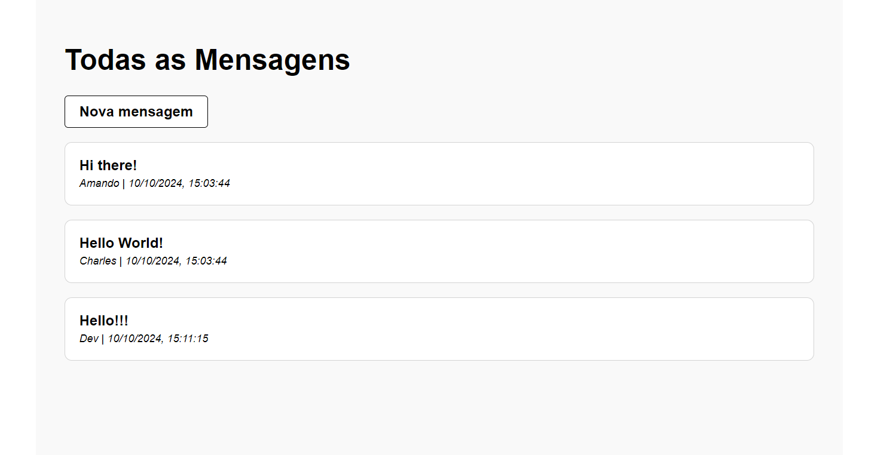

# Message App

Este é um projeto de um aplicativo de envio de mensagens proposto pelo site [The Odin Project](https://www.theodinproject.com/) para fixar o aprendizado sobre NodeJS e Express. O projeto está online em [warp-brindle-fir.glitch.me](https://warp-brindle-fir.glitch.me/).



## Como Executar

1. **Clone o repositório:**

```bash
git clone https://github.com/Diego-Moreira8/odin-message-app.git
```

2. **Instale as dependências:**

```bash
cd odin-message-app
npm install
```

3. **Execute o aplicativo:**

```bash
npm run dev
```

Isso iniciará um servidor de desenvolvimento local na porta 3000.

---

_Nota: Este projeto é apenas para fins educacionais e de aprendizado. Não é recomendado para uso em produção sem considerar práticas de segurança adequadas._
